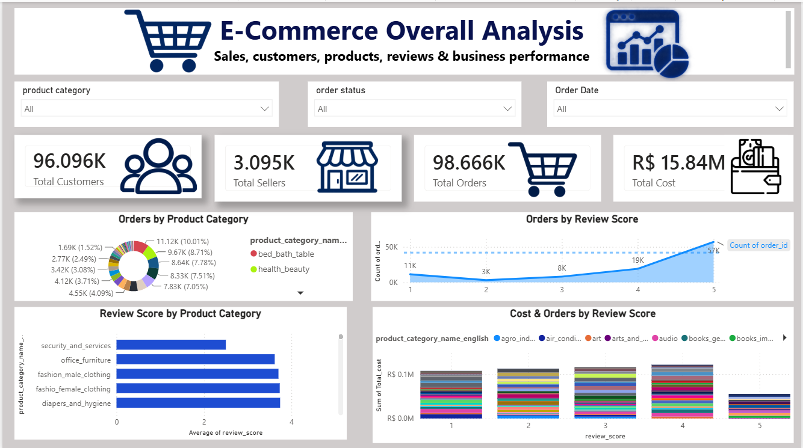
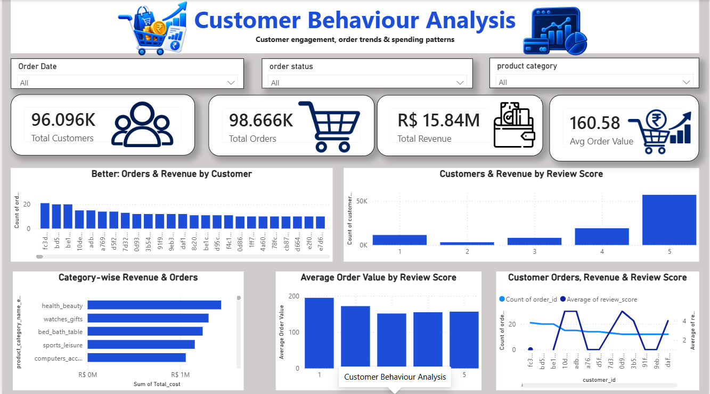
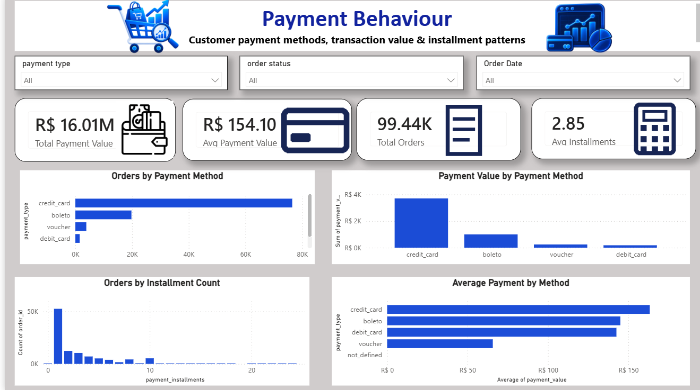
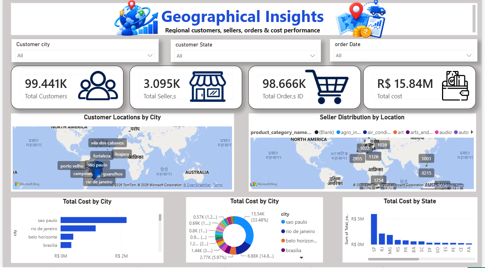
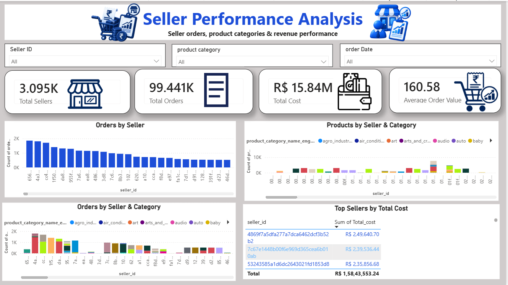

# E-Commerce Data Analysis Dashboard

Interactive Power BI dashboard analyzing e-commerce business performance across customers, sellers, orders, payments, products, reviews, delivery, shipping, and geographical regions. The dashboard includes interactive slicers, KPI cards, charts, and maps to explore key business insights.

---

## 📊 Project Overview

This project is an interactive **Power BI dashboard** created to analyze and understand e-commerce business performance.

The dashboard provides insights into **customers, sellers, orders, payments, products, reviews, delivery, shipping, and geographical performance**. Interactive slicers and visualizations allow users to explore different aspects of the e-commerce data.

---

## 📌 Dashboard Pages

### 1. E-Commerce Overall Analysis

Provides an overall view of the e-commerce business, including:

- Total Customers
- Total Sellers
- Total Orders
- Total Cost
- Product Category Performance
- Review Score Analysis



---

### 2. Customer Behaviour

Analyzes customer activity and purchasing behaviour, including:

- Customer Orders
- Order Value
- Review Behaviour
- Spending Patterns
- Product Preferences



---

### 3. Payment Behaviour

Analyzes customer payment patterns, including:

- Payment Methods
- Total Payment Value
- Average Payment Value
- Payment Installments
- Orders by Payment Method



---

### 4. Delivery & Shipping Analysis

Analyzes delivery and shipping performance, including:

- Average Delivery Delay
- Average Shipping Charge
- Average Response Time
- Average Delivery Distance
- Shipping Cost by Distance
- Delivery Performance by City and Category


---

### 5. Geographical Analysis

Analyzes the geographical distribution of customers, sellers, and orders, including:

- Customer Locations
- Seller Distribution
- Orders by City
- Cost by City
- Cost by State



---

### 6. Seller Performance Analysis

Analyzes seller-level performance, including:

- Total Sellers
- Seller Orders
- Products by Seller and Category
- Orders by Seller and Category
- Seller Cost Performance
- Average Order Value



---

## 🛠️ Tools & Technologies

- **Power BI** – Dashboard development and visualization
- **Data Analysis** – Exploring e-commerce business patterns
- **Interactive Slicers** – Filtering and exploring dashboard data
- **KPI Cards** – Tracking key business metrics
- **Charts & Maps** – Visual analysis of business performance

---

## 📈 Key Insights

The dashboard helps analyze:

- Customer purchasing behaviour
- Seller performance
- Payment preferences
- Product and category performance
- Customer review patterns
- Delivery and shipping performance
- Geographical distribution
- Overall e-commerce business performance

---

## 🎯 Project Objective

The objective of this project is to transform e-commerce data into meaningful business insights using **Power BI dashboards and data visualization techniques**.

The dashboard provides an interactive way to explore business performance across different dimensions such as customers, sellers, products, payments, delivery, reviews, and geography.

---

## 📂 Project Structure

```text
E-Commerce-Data-Analysis/
│
├── README.md
│
├── Customer_Behaviour_Analysis.png
├── Delivery_&_Shipping_analysis.png
├── E-commerce-overall-Analysis.png
├── Geographical_analysis.png
├── Payment_Behaviour_analysis.png
└── Seller_performance_analysis.png
